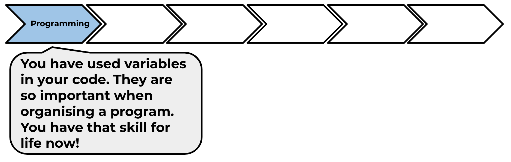

## What next?

Try out the next project, 'Dodgeball', where you will make a game in which you have to avoid balls while moving from platform to platform.

You will find this project in the module pathway.

--- no-print ---

Click the green flag to start, and then use the arrow keys to move and the <kbd>space</kbd> key to jump.

  <iframe allowtransparency="true" width="485" height="402" src="https://scratch.mit.edu/projects/embed/251809924/?autostart=false" frameborder="0" scrolling="no"></iframe>
  

--- /no-print ---

--- print-only ---

--- /print-only ---

Click on the 'Click me' button to try the next project:

<a href="https://codeclub.org/en/scratch2">

